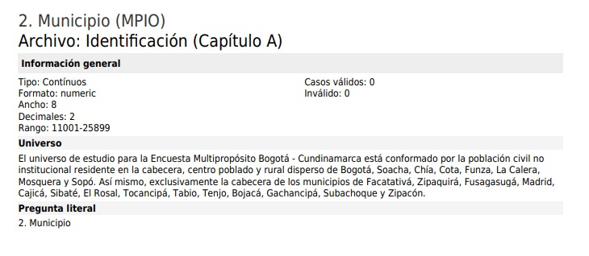

# Resolución de Desafíos del Tercer Curso de Inmersión de Datos de Alura Latam

En el tercer día de la semana de inmersión de datos de alura latam se dejan los siguientes desafíos:

<b>-1. Dar un vistazo a la base de datos del DANE, entender estas variables conceptualmente para entender mejor el contexto de esta base.</b>

<b>-2. Organizar tu notebook para que tu proyecto quede mejor presentado.</b>

Sin embargo, en el curso los instructores además piden mostrar gráficos de cajas para las respuestas del desafío de la clase 2 por lo que empiezo creando gráficos de caja para extender dicho desafío.

En primer lugar analizo el top 10 de barrios con mayores precios promedio por metro cuadrado y su **distribución de precios** y para ello escribo el siguiente código:

```
barrios_top_10_mayores=inmuebles_mayor_precio['Barrio']
#barrios_top_10_mayores.values #esta es la lista con la cual filtro la columna Barrio
BarriosTop10Mayores=inmuebles.query('Barrio in @barrios_top_10_mayores.values')[['Barrio','PrecioMillon']]
BarriosTop10Mayores['Barrio'].value_counts()
plt.figure(figsize=(10,8))
ax = sns.boxplot(x="Barrio", y="PrecioMillon", data = BarriosTop10Mayores)
ax.tick_params(axis='x', rotation=45)

plt.show()
```

Dicho código me genera el siguiente gráfico:


Ahora me propongo generar un boxplot para el top 10 de barrios con **menor** precio promedio por metro cuadrado y su **distribución de precios** y para ello escribo el siguiente código:

```
barrios_top_10_menores=inmuebles_menor_precio['Barrio']
barrios_top_10_menores.values
BarriosTop10Menores=inmuebles.query('Barrio in @barrios_top_10_menores.values')[['Barrio','PrecioMillon']]
BarriosTop10Menores['Barrio'].value_counts()

plt.figure(figsize=(10,8))
ax = sns.boxplot(x="Barrio", y="PrecioMillon", data = BarriosTop10Menores)
ax.tick_params(axis='x', rotation=45)

plt.show()

```

Dicho código me genera el siguiente gráfico:


Como se puede observar, para estos barrios existen outliers y si se calcula el precio promedio por metro cuadrado por Barrio dividiendo para cada inmueble su precio y área para luego realizar una agrupación por Barrio y promediar las divisiones anteriores, se obtendrán precios promedio por metro cuadrado de cada barrio **sesgados** debido al precio de los outliers, lo mismo ocurré para las áreas. Por ejemplo, tomando los barrios del top 10 menores de precio por metro cuadrado y gráficando en función de las áreas de cada inmueble tengo la siguiente figura:


Se observa un notorio valor outlier para el área del Barrio Modelia el cual influye sobre el precio por metro cuadrado y el cual se "oculta" al realizar promedios sobre promedios.

Para no caer presa de tal sesgo, el cálculo se debe realizar, primero, sumando los precios y áreas para cada barrio y luego dividir ambas columnas y siguiendo ese razonamiento obtengo los valores de precio por metro cuadrado mayores y menores top 10 siguientes:


## Comparación Apartamento, Casa y Finca

En el desafío de la clase 2 obtuve el siguiente gráfico combinado de histogramas:


Lo que haré ahora es crear gráficos de cajas y para ello escribo el siguiente código:

```
arrayTipo=['Apartamento','Casa','Finca']
DataFrameTiposPrecios=inmuebles.query('Tipo in @arrayTipo')[['Tipo','PrecioMillon']]
plt.figure(figsize=(10,8))
ax = sns.boxplot(x="Tipo", y="PrecioMillon", data = DataFrameTiposPrecios)
ax.tick_params(axis='x', rotation=45)


plt.show()
```

Dicho código me genera el siguiente gráfico:


Se puede observar que para el caso de apartamentos y casas las distribuciones se concentran en valores bajos los 2000 Millones de pesos colombianos existiendo colas para ambos hacia la derecha. Por lo que la conclusión a la que llegué en la clase 2 se reafirma.

## **Resolución Desafío 1**

Al revisar la documentación y el diccionario de datos del D.A.N.E. encuentro en la Ficha Metodológica que el alcance de la data es:

> La Encuesta Multipropósito Bogotá - Cundinamarca (EM 2021) es una operación
> estadística que permite recoger información sobre diferentes aspectos de las
> condiciones de vida y capacidad de pago de los habitantes de Bogotá y de los
> municipios seleccionados del departamento de Cundinamarca.

En otras palabras la data trata sobre información transversal útil para planificar políticas públicas.

Por otro lado, al revisar el pdf con la estructura de datos se verifica que la llave para la unión de tablas es la columna **DIRECTORIO** como bien puede leerse en la imagen siguiente:


Ahora muestro a qué corresponde el campo MPIO del Capítulo A: Identificación el cual contiene 22 valores diferentes para las localidades señaladas:



Por último, muestro las primeras 5 filas del dataframe unido:


## **Resolución Desafío 2**

El desafío 2 consiste en organizar el notebook para lo cual creo un **nuevo** notebook el cual denomino Datos_DANE.ipynb. Dicho notebook muestra de manera muy ordenada cada código. Para ejecutar dicho notebook he creado una carpeta en mi root local llamada **archivoscsv** la cual contiene los csv con la data de los capítulos A, B, C, E, H, K y L los cuales cargo usando los comandos siguientes:

```
datos_raw = pd.read_csv('./archivoscsv/Identificación (Capítulo A).csv', sep = ';',encoding='latin-1')
datos_b = pd.read_csv('./archivoscsv/Datos de la vivenda y su entorno (Capítulo B).csv',sep=';',encoding='latin-1')
datos_c = pd.read_csv('./archivoscsv/Condiciones habitacionales del hogar (Capítulo C).csv',sep=';',encoding='latin-1')
datos_e = pd.read_csv('./archivoscsv/Composición del hogar y demografía (Capítulo E).csv',sep=';',encoding='latin-1')
datos_h = pd.read_csv('./archivoscsv/Educación (Capítulo H).csv',sep=';',encoding='latin-1')
datos_k = pd.read_csv('./archivoscsv/Fuerza de trabajo (Capítulo K).csv',sep=';',encoding='latin-1')
```

Por el tamaño de los archivos no cargo tales archivos a mi repositorio, no obstante, se pueden descargar tales archivos desde el siguiente link: [LINK DE DESCARGA DE CAPITULOS](https://caelum-online-public.s3.amazonaws.com/alura-latam-inmersion-datos/alura_latam-inmersion_datos-arhivos_descarga/archivos-dane.zip)

Por último, realizo los LEFT JOINS entre las tablas usando la columna DIRECTORIO y el resumen de información de dicho DataFrame es el siguiente:


Se observa el gran tamaño de dicho dataframe y que, gracias a las librerías de manipulación de data de Python, operaciones sobre tal tamaño de data estan **optimizadas**. Aquí se puede constatar el gran beneficio de utilizar las librerías de Python para ciencia de datos al trabajar sobre big data.

Por último, escribo código para exportar dicho dataframe a un archivo .csv el cual puede ser manipulado utilizando Power BI, por ejemplo:

```
datos_dane.to_csv('datos_daneUNIDOS.csv', index=False)
```
